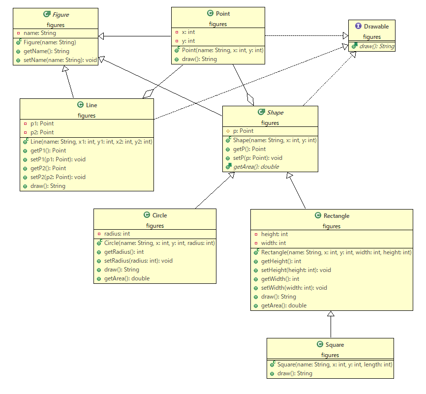

# Lesson6 オブジェクト指向プログラミング2 追加課題

## 様々な図形を表現するクラスの集合を扱う課題

2次元座標の中の様々な図形を表現するクラスを作成し、そのインスタンスたちをListを使って一元管理するプログラムを作成していきましょう。

__今回、figuresというパッケージの中に作成するクラス、インターフェースは以下の9つです。__

1. Figure.java ... 「図形」という抽象的な概念を表現する抽象クラス
2. Drawable.java ... 図形の特徴を文字列として表現する抽象メソッドを持つインターフェース
3. Point.java ... 「点」という概念を表現するクラス
4. Line.java ... 「線分（両端を持つ直線）」という概念を表現するクラス
5. Shape.java ... 「面積という概念を持つ図形」を表現する抽象クラス
6. Circle.java ... 「円」をいう概念を表現するクラス
7. Rectange.java ... 「長方形」という概念を表現するクラス
8. Square.java ... 「正方形」という概念を表現するクラス
9. Review04Advance.java ... mainメソッドを持つクラス

これらのクラス、インターフェースの継承関係を表すクラス図は以下となります。



### 仕様

作成するクラス、インターフェースの詳細な仕様は以下となります。

フィールド変数に関しては、すべてセッター・ゲッターを作成するものとします。

※　下記の表において、以下は省略するとします。
- セッター・ゲッター
- 継承されたフィールド変数
- オーバーライドされたメソッド


#### __Figure.java（図形を表す抽象クラス）__

|  フィールド変数名  |  意味 | 型 | アクセス修飾子 | 
| ---- | ---- | ---- | ---- |
|  name  |  図形の名前 | String  | private |


|  メソッド  | 意味 |  アクセス修飾子 | 引数  | 戻り値 |
| ---- | ---- | ---- | ---- | ---- |
|  public Figure(String name)  |  コンストラクタ  | public | name(図形の名前) | なし | 


#### __Drawable.java（図形の特徴を表すメソッドを持つインターフェース）__


|  メソッド  | 意味 |  アクセス修飾子 | 引数  | 戻り値 |
| ---- | ---- | ---- | ---- | ---- |
|  public abstract String draw()  |  図形の特徴を文字列として表現する  | public | なし | 文字列 | 


#### __Point.java（「点」を表すクラス）__

Figureクラスを継承し、Drawableインターフェースを実装します。

|  フィールド変数名  |  意味 | 型 | アクセス修飾子 |
| ---- | ---- | ---- | ---- |
|  x  |  点のx座標 | int | private |
|  y  |  点のy座標 |int | private |


|  メソッド  | 意味 |  アクセス修飾子 | 引数  | 戻り値 |
| ---- | ---- | ---- | ---- | ---- |
|  public Point(String name, int x, int y)  |  コンストラクタ  | public | name(図形の名前), x(x座標), y(y座標) | なし | 

#### __Line.java（「線分」を表すクラス）__

Figureクラスを継承し、Drawableインターフェースを実装します。

|  フィールド変数名  |  意味 | 型  | アクセス修飾子 |
| ---- | ---- | ---- | ---- |
|  p1 | 線分の一方の端の点 | Point | private |
|  p2  |  線分の他方の端の点 | Point | private |


|  メソッド  | 意味 |  アクセス修飾子 | 引数  | 戻り値 |
| ---- | ---- | ---- | ---- | ---- |
|  public Line(String name, int x1, int y1, int x2, int y2)  |  コンストラクタ  | public | name(図形の名前), x1(線分の一方の端の点のx座標), y1(線分の一方の端の点y座標), x2(線分の他方の端の点のx座標), y2(線分の他方の端の点y座標) | なし | 


#### __Shape.java（「面積という概念を持つ」抽象クラス）__

Figureクラスを継承し、Drawableインターフェースを実装します。

|  フィールド変数名  |  意味 | 型  | アクセス修飾子 | 
| ---- | ---- | ---- | ---- |
|  p | 図形に特徴的な点 | Point | protected |


|  メソッド  | 意味 |  アクセス修飾子 | 引数  | 戻り値 |
| ---- | ---- | ---- | ---- | ---- |
|  public Shape(String name, int x, int y)  |  コンストラクタ  | public | name(図形の名前), x(x座標), y(y座標) | なし | 
|  public abstract double getArea()  |  図形の面積を求める  | public | なし | 面積の値 | 


#### __Circle.java（「円」を表現するクラス）__

Shapeクラスを継承します。

|  フィールド変数名  |  意味 | 型  | アクセス修飾子 | 
| ---- | ---- | ---- | ---- |
|  radius | 円の半径 | int | private |


#### __Rectange.java（「長方形」を表現するクラス）__

Shapeクラスを継承します。

|  フィールド変数名  |  意味 | 型  | アクセス修飾子 | 
| ---- | ---- | ---- | ---- |
|  width | 長方形の横幅 | int | private |
|  height | 長方形の高さ | int | private |


|  メソッド  | 意味 |  アクセス修飾子 | 引数  | 戻り値 |
| ---- | ---- | ---- | ---- | ---- |
|  public Rectangle(String name, int x, int y, int width, int height)  |  コンストラクタ  | public | name(図形の名前), x(長方形の左上隅の点のx座標), y(長方形の左上隅の点のy座標), width(長方形の横幅), height(長方形の高さ) | なし | 


#### __Square.java（「正方形」を表現するクラス）__

Rectangeクラスを継承します。


|  メソッド  | 意味 |  アクセス修飾子 | 引数  | 戻り値 |
| ---- | ---- | ---- | ---- | ---- |
|  public Square(String name, int x, int y, int length)   |  コンストラクタ  | public | name(図形の名前), x(正方形の左上隅の点のx座標), y(正方形の左上隅の点のy座標), length(正方形の一辺の長さ) | なし | 


#### __Review04Advance.java（mainメソッドを持ったクラス）__

以下のひな形を利用してください。

「ここを埋めてください」の箇所を実装してください。

		package figures;
		
		import java.util.ArrayList;
		import java.util.List;
		
		public class Review04Advance {
		
			public static void main(String[] args) {
		
				// 図形リスト作成
				List<Figure> figureList = new ArrayList<>();
		
				// 図形リストの5個の具体的なクラスのインスタンスを追加
				figureList.add(new Point("点", 1, 2));
				figureList.add(new Line("線分", 1, 1, 2, 2));
				figureList.add(new Circle("円", 1, 1, 3));
				figureList.add(new Rectangle("長方形", 1, 1, 3, 4));
				figureList.add(new Square("正方形", 10, 10, 3));
		
				// 図形の個数を表示
				System.out.println("図形の合計の個数は" + figureList.size() + "個");
		
				// 図形リストのそれぞれの要素を内容を表示
				for (Figure f : figureList) {
						// ここを埋めてください
				}
			}
		}

実行結果例は以下となるように、すべてのクラスの実装を完成してください。

```bash
図形の合計の個数は5個
点(1, 2)
点(1, 1)と点(2, 2)を結ぶ線分
点(1, 1)を中心とした半径3の円
面積は28.274333882308138
点(1, 1)を左上の座標とした横幅3高さ4の長方形
面積は12.0
点(10, 10)を左上の座標とした一辺の長さが3の正方形
面積は9.0
```


## 解答例


#### Figure.java 
```java
package figures;

// 図形
public abstract class Figure {

	// 図形の名前
	private String name;

	// コンストラクタ
	public Figure(String name) {
		this.name = name;
	}

	// セッター、ゲッター
	public String getName() {
		return name;
	}

	public void setName(String name) {
		this.name = name;
	}

}
```

#### Drawable.java
```java
package figures;

public interface Drawable {

	// 図形を文字列で表現するメソッド
	public abstract String draw();

}
```

#### Point.java
```java
package figures;

// 点
public class Point extends Figure implements Drawable {

	// x座標
	private int x;
	// y座標
	private int y;

	// コンストラクタ
	public Point(String name, int x, int y) {
		super(name);
		this.x = x;
		this.y = y;
	}

	@Override
	public String draw() {
		// TODO 自動生成されたメソッド・スタブ
		return this.getName() + "(" + this.x + ", " + y + ")";
	}

}
```

#### Line.java
```java
package figures;

// 線分
public class Line extends Figure implements Drawable {

	// 線分の両端の点
	private Point p1;
	private Point p2;

	// コンストラクタ
	public Line(String name, int x1, int y1, int x2, int y2) {
		super(name);
		p1 = new Point("点", x1, y1);
		p2 = new Point("点", x2, y2);

	}

	// セッター、ゲッター
	public Point getP1() {
		return p1;
	}

	public void setP1(Point p1) {
		this.p1 = p1;
	}

	public Point getP2() {
		return p2;
	}

	public void setP2(Point p2) {
		this.p2 = p2;
	}

	@Override
	public String draw() {
		return p1.draw() + "と" + p2.draw() + "を結ぶ" + this.getName();
	}

}
```

#### Shape.java
```java
package figures;

// 面積を持つ図形
public abstract class Shape extends Figure implements Drawable {

	// 点
	protected Point p;

	// コンストラクタ
	public Shape(String name, int x, int y) {
		super(name);
		p = new Point("点", x, y);
	}

	// セッター、ゲッター
	public Point getP() {
		return p;
	}

	public void setP(Point p) {
		this.p = p;
	}


	// 図形の面積の値を求めるメソッド
	public abstract double getArea();

}
```

#### Circle.java
```java
package figures;

public class Circle extends Shape {

	private int radius;

	public Circle(String name, int x, int y, int radius) {
		super(name, x, y);
		this.radius = radius;
	}

	public int getRadius() {
		return radius;
	}

	public void setRadius(int radius) {
		this.radius = radius;
	}

	@Override
	public String draw() {
		return p.draw() + "を中心とした半径" + this.radius + "の" + this.getName();
	}

	@Override
	public double getArea() {
		// TODO 自動生成されたメソッド・スタブ
		return Math.PI * Math.pow(this.radius, 2);
	}

}
```

#### Rectange.java
```java
package figures;

// 長方形
public class Rectangle extends Shape {

	// 高さ
	private int height;
	// 横幅
	private int width;

	// コンストラクタ
	public Rectangle(String name, int x, int y, int width, int height) {
		super(name, x, y);
		this.width = width;
		this.height = height;
	}

	// セッター、ゲッター
	public int getHeight() {
		return height;
	}

	public void setHeight(int height) {
		this.height = height;
	}

	public int getWidth() {
		return width;
	}

	public void setWidth(int width) {
		this.width = width;
	}

	@Override
	public String draw() {
		return p.draw() + "を左上の座標とした横幅" + this.width + "高さ" + this.height + "の" + this.getName();
	}

	@Override
	public double getArea() {
		return this.width * this.height;
	}

}
```

#### Square.java
```java
package figures;

// 正方形
public class Square extends Rectangle {

	// コンストラクタ
	public Square(String name, int x, int y, int length) {
		super("正方形", x, y, length, length);
	}

	@Override
	public String draw() {
		return p.draw() + "を左上の座標とした一辺の長さが" + this.getWidth() + "の" + this.getName();
	}

}
```

#### Review04Advance


    package figures;
    
    import java.util.ArrayList;
    import java.util.List;
    
    public class Review04Advance {
    
    	public static void main(String[] args) {
    
    		// 図形リスト作成
    		List<Figure> figureList = new ArrayList<>();
    
    		// 図形リストの5個の具体的なクラスのインスタンスを追加
    		figureList.add(new Point("点", 1, 2));
    		figureList.add(new Line("線分", 1, 1, 2, 2));
    		figureList.add(new Circle("円", 1, 1, 3));
    		figureList.add(new Rectangle("長方形", 1, 1, 3, 4));
    		figureList.add(new Square("正方形", 10, 10, 3));
    
    		// 図形の個数を表示
    		System.out.println("図形の合計の個数は" + figureList.size() + "個");
    
    		// 図形リストのそれぞれの要素を内容を表示
    		for (Figure f : figureList) {
    			if (f instanceof Point) {
    				System.out.println(((Point) f).draw());
    			} else if (f instanceof Line) {
    				System.out.println(((Line) f).draw());
    			} else if (f instanceof Shape) {
    				System.out.println(((Shape) f).draw());
    				System.out.println("面積は" + ((Shape) f).getArea());
    			}
    		}
    	}
    }
